# Database Schema

Final-state schema after all 22 Liquibase changesets (`src/main/resources/db/changelog/changes/001` → `022`), as of 2026-09-16. All tables use `BIGSERIAL`/`BIGINT` ids (migration 005 reverted an earlier UUID experiment — see "History" below). Extensions in use: `cube`, `earthdistance`, `btree_gist` (`pgcrypto` was dropped in migration 022 — it backed `gen_random_uuid()` on the UUID-keyed tables from migration 004, which migration 005 replaced with BIGSERIAL; nothing has called a pgcrypto function since).

## Entity-relationship diagram

```mermaid
erDiagram
    users ||--o{ otps : "has"
    users ||--o{ refresh_tokens : "has"
    users ||--o{ password_reset_tokens : "has"
    users ||--o| parent : "is-a"
    users ||--o| nanny : "is-a"
    users ||--o| waitlist_signups : "has"
    users ||--o{ booking_requests : "requests"

    parent ||--o{ parent_child : "has"
    children ||--o{ parent_child : "has"
    parent ||--o{ parent_address : "has"
    parent ||--o{ booking : "books"

    nanny ||--o{ nanny_verification : "has"
    nanny ||--o{ nanny_language : "speaks"
    language ||--o{ nanny_language : "spoken by"
    nanny ||--o{ nanny_skill : "has"
    skill ||--o{ nanny_skill : "held by"
    nanny ||--o{ nanny_service_area : "serves"
    nanny ||--o{ booking : "assigned to"
    nanny ||--o{ caregiver_zone_mapping : "rated in"

    booking ||--o| review : "reviewed by"
    parent ||--o{ review : "writes"
    nanny ||--o{ review : "receives"

    zone_areas ||--o{ zone_service_pricing : "priced by"
    zone_areas ||--o{ serviceability_pincode : "covers"
    zone_areas ||--o{ serviceability_service_type : "rolled out for"
    zone_areas ||--o{ caregiver_zone_mapping : "maps"
    zone_areas ||--o{ zone_demand_snapshot : "measured"
    zone_areas ||--o{ booking_requests : "requested in"

    service_types ||--o{ zone_service_pricing : "priced"
    service_types ||--o{ serviceability_service_type : "rolled out"
    service_types ||--o{ caregiver_zone_mapping : "mapped"
    service_types ||--o{ zone_demand_snapshot : "measured"
    service_types ||--o{ booking_requests : "requested"
    service_types ||--o{ booking : "vertical of"

    zone_service_pricing ||--o{ zone_pricing_rules : "surged by"
    zone_service_pricing ||--o| dynamic_pricing_config : "tuned by"
```

*(`waitlist` here refers to `serviceability_waitlist` — a separate, per-zone/service-type table not shown linked above since its FKs are nullable/best-effort.)*

---

## Identity & Auth

### `users`
The single identity table across all auth channels (Google / phone / email / guest).

| Column | Type | Notes |
|---|---|---|
| `id` | BIGSERIAL PK | |
| `name` | VARCHAR(255) | nullable |
| `email` | VARCHAR(255) UNIQUE | nullable — not every channel has one |
| `phone` | VARCHAR(20) UNIQUE | nullable, stored E.164 (`+91XXXXXXXXXX`) |
| `password` | VARCHAR(255) | nullable — null until a password channel is set up (e.g. Google-only users) |
| `google_id` | VARCHAR(255) UNIQUE | nullable |
| `is_active` | BOOLEAN NOT NULL | default `true` |
| `email_verified` | BOOLEAN NOT NULL | default `false` |
| `phone_verified` | BOOLEAN NOT NULL | default `false` |
| `user_source` | VARCHAR(20) NOT NULL | `GOOGLE` / `PHONE` / `EMAIL` / `GUEST` / `WAITLIST` |
| `user_type` | VARCHAR(20) NOT NULL | `PARENT` / `NANNY` / `ADMIN` |
| `status` | SMALLINT NOT NULL | `0=ACTIVE, 1=DELETED, 2=DEACTIVATED` (added in 006 as ACTIVE/DELETED only; `DEACTIVATED` added in 021 and backfilled from rows where `is_active=false`). `is_active` is still what auth actually reads for login gating — dropping it in favor of `status` is a separate, later release once nothing reads it. |
| `deleted_at` | TIMESTAMPTZ | added in 006 |
| `created_at` / `updated_at` | TIMESTAMP NOT NULL | |

### `otps`
| Column | Type | Notes |
|---|---|---|
| `id` | BIGSERIAL PK | |
| `user_id` | BIGINT FK → `users.id` ON DELETE CASCADE | nullable |
| `phone_or_email` | VARCHAR(255) NOT NULL | the identifier the OTP was sent to |
| `otp` | VARCHAR(255) NOT NULL | BCrypt hash, not plaintext |
| `purpose` | VARCHAR(20) NOT NULL | e.g. `RESET_PASSWORD`, `LOGIN` (mobile OTP login/signup) |
| `challenge_id` | VARCHAR(64) UNIQUE | added in 033 — opaque id handed to mobile clients for `/auth/mobile/otp/{request,verify}` instead of the raw phone number; null for the older email-only OTP rows |
| `attempt_count` | INT NOT NULL DEFAULT 0 | |
| `expires_at` | TIMESTAMP NOT NULL | |
| `is_used` | BOOLEAN NOT NULL DEFAULT false | |
| `created_at` | TIMESTAMP NOT NULL | |

Indexes: `(phone_or_email, purpose)`, `(user_id)`. `challenge_id`'s UNIQUE constraint also indexes it; Postgres allows unlimited NULLs there so pre-033 rows are unaffected.

### `refresh_tokens`
| Column | Type | Notes |
|---|---|---|
| `id` | BIGSERIAL PK | |
| `user_id` | BIGINT NOT NULL FK → `users.id` ON DELETE CASCADE | |
| `token` | VARCHAR(500) UNIQUE NOT NULL | opaque, base64url random bytes — not a JWT |
| `expires_at` | TIMESTAMP NOT NULL | this token's own TTL (`app.jwt.refresh-token-ttl-days`, default 7d) |
| `session_expires_at` | TIMESTAMP | added in 033 — a hard session ceiling (mobile OTP login: `app.mobile-otp.session-hours`, default 72h from login) copied forward unchanged on every rotation via `/auth/refresh`, so refreshing never extends it. Null for flows that don't enforce one (Google/email/phone-password login) |
| `revoked` | BOOLEAN NOT NULL DEFAULT false | |
| `created_at` | TIMESTAMP NOT NULL | |

### `password_reset_tokens`
| Column | Type | Notes |
|---|---|---|
| `id` | BIGSERIAL PK | |
| `user_id` | BIGINT NOT NULL FK → `users.id` ON DELETE CASCADE | |
| `token` | VARCHAR(255) UNIQUE NOT NULL | |
| `expires_at` | TIMESTAMP NOT NULL | |
| `used` | BOOLEAN NOT NULL DEFAULT false | |
| `created_at` | TIMESTAMP NOT NULL | |

Dropped in migration 004's identity rewrite, recreated in migration 013 to back the "set your password" link sent to waitlist/email signups.

---

## Nanny marketplace (migration 006)

### `parent`
`id`, `user_id` (UNIQUE FK → `users.id` CASCADE), `first_name`, `last_name`, `meta_data` JSONB, `created_at`, `updated_at`.

### `nanny`
`id`, `user_id` (UNIQUE FK → `users.id` CASCADE), `first_name`, `last_name`, `bio`, `profile_photo_s3_key`, `education_level`, `years_experience`, `hourly_rate` NUMERIC(10,2), `overall_verification_status` SMALLINT (`1=PENDING, 2=PARTIAL, 3=VERIFIED, 4=REJECTED`), `meta_data` JSONB, `created_at`, `updated_at`.

### `nanny_verification`
`id`, `nanny_id` (FK → `nanny.id` CASCADE), `type` SMALLINT (`1=ID_PROOF, 2=BACKGROUND_CHECK, 3=EDUCATION, 4=FIRST_AID, 5=REFERENCE`), `s3_key`, `status` SMALLINT (`1=PENDING, 2=VERIFIED, 3=REJECTED`), `vendor_reference_id`, `reviewed_by` (FK → `users.id`), `reviewed_at`, `rejection_reason`, `created_at`, `updated_at`.

### `language` / `nanny_language`
`language(id, name UNIQUE, is_active)`. `nanny_language(nanny_id, language_id, proficiency SMALLINT [1=BASIC..4=NATIVE])`, composite PK.

### `skill` / `nanny_skill`
`skill(id, name UNIQUE)`. `nanny_skill(nanny_id, skill_id)`, composite PK.

### `nanny_service_area`
`id`, `nanny_id` (FK CASCADE), `lat`, `lng` DOUBLE PRECISION, `radius_km` INT DEFAULT 10. GiST-indexed on `ll_to_earth(lat, lng)`.

### `children` / `parent_child`
`children(id, first_name, last_name, dob DATE NOT NULL, gender, meta_data JSONB, created_at)`. `parent_child(parent_id, child_id, relationship SMALLINT [0=PARENT,1=GUARDIAN], is_primary_contact)`, composite PK.

### `parent_address`
`id`, `parent_id` (FK CASCADE), `label` SMALLINT (`1=HOME, 2=WORK, 3=OTHER`), `address_line1/2`, `landmark`, `access_notes`, `pincode` VARCHAR(6), `city`, `state`, `country` DEFAULT `'India'`, `lat`/`lng`, `is_primary`. GiST geo index.

### `booking`
`id`, `parent_id` (FK), `nanny_id` (FK), `child_id` (nullable FK, added migration 018), `service_type_id` (FK → `service_types.id`, added migration 018), `address_id` (nullable FK), `start_time`/`end_time` TIMESTAMPTZ, `status` SMALLINT (`1=PENDING,2=CONFIRMED,3=IN_PROGRESS,4=COMPLETED,5=CANCELLED`), `cancelled_by` (FK → users), `cancellation_reason`, `total_amount`, `created_at`.
- Originally childcare-only (`child_id` required, no vertical column) even though `service_types` already listed `senior_care`/`pet_care`/`tutoring`/`housekeeping`/`adult_care`. Migration 018 added `service_type_id` (backfilled to `childcare` for all pre-existing rows) and relaxed `child_id` to nullable, since a non-childcare booking has no care-recipient to attach. "`child_id` required when `service_type_id` is childcare" is enforced at the app layer, not a DB constraint/trigger — that's deliberately deferred until bad rows are actually observed in practice.
- **`no_overlapping_bookings`**: an `EXCLUDE USING gist` constraint preventing the same nanny from having two overlapping bookings while status is `PENDING`/`CONFIRMED`/`IN_PROGRESS`.
- Indexes: `(nanny_id, start_time)`, `(parent_id, start_time)`, `(service_type_id)`.

### `review`
`id`, `booking_id` (UNIQUE FK), `parent_id` (FK), `nanny_id` (FK), `rating` SMALLINT CHECK 1–5, `comment`, `created_at`.

### `ranking_config`
`id`, `factor` SMALLINT (`1=DISTANCE,2=PRICE,3=EXPERIENCE,4=RATING`), `weight` NUMERIC(4,3), `active_from`, `created_by` (FK → users). Search ranking is a tunable, versioned weighted blend of these 4 factors.

---

## Serviceability & Pricing engine (migration 008)

### `service_types`
`id`, `code` UNIQUE (`childcare`, `senior_care`, `adult_care`, `pet_care`, `tutoring`, and `housekeeping` added in migration 016), `name`, `pricing_unit` CHECK IN (`hourly`, `per_visit`, `per_session`, `monthly`), `is_active`, timestamps.

### `zone_areas`
`id`, `name` (UNIQUE, added migration 009), `city`, `state`, `centroid_lat`/`centroid_lng`, `is_active`, timestamps. GiST geo index on centroid. Seeded with 4 broad Bangalore zones (009) then superseded by 104 named-locality zones (011, centroids backfilled in 012) plus Gurgaon/Patna/Noida pincode-level placeholder zones (015).

### `zone_service_pricing`
`id`, `zone_area_id` (FK), `service_type_id` (FK), `pricing_mode` CHECK IN (`fixed`,`range`), `fix_price`, `rate_min`/`rate_max`, `unit_price`, `currency` DEFAULT `'INR'`, `min_booking_hours`, `platform_fee_pct`, `is_active`, timestamps. UNIQUE `(zone_area_id, service_type_id)`. Check constraints enforce `fix_price` is set when mode is `fixed`, and `rate_min <= rate_max` when mode is `range`.

### `zone_pricing_rules`
`id`, `zone_service_pricing_id` (FK CASCADE), `day_type` CHECK IN (`weekday`,`weekend`,`holiday`), `start_time`/`end_time` TIME, `price_multiplier` NUMERIC(4,2) DEFAULT 1.0, `adjusted_fix_price`, `priority`, `is_active`, `created_at`. Check: `end_time > start_time`. Surge/time-of-day pricing rules layered on top of a zone's base price.

### `serviceability_pincode`
`id`, `pincode` VARCHAR(6) UNIQUE, `zone_area_id` (FK), `is_serviceable`, `status` CHECK IN (`live`,`coming_soon`,`not_planned`), timestamps.

### `serviceability_service_type`
`id`, `zone_area_id` (FK), `service_type_id` (FK), `status` CHECK IN (`live`,`coming_soon`,`not_planned`) DEFAULT `not_planned`, `launched_at`, timestamps. UNIQUE `(zone_area_id, service_type_id)`. A service type with no row here for a zone defaults to `not_planned` in the app layer (see migration 016's housekeeping note).

### `geocode_cache`
`id`, `query_text`, `normalized_query` UNIQUE, `lat`/`lng`, `formatted_address`, `provider`, `created_at`. Caches Nominatim geocoding lookups.

### `serviceability_waitlist`
`id`, `pincode` (nullable), `zone_area_id` (nullable FK), `service_type_id` (nullable FK), `contact` NOT NULL, `notified_at`, `created_at`. "Notify me when this launches" for a not-yet-serviceable area.

### `caregiver_zone_mapping`
`id`, `nanny_id` (FK → `nanny.id` CASCADE; named `caregiver_id` before migration 019 — renamed to match every other FK-to-`nanny` column in the schema), `zone_area_id` (FK), `service_type_id` (FK), `own_rate`, `is_active`, `created_at`. UNIQUE `(nanny_id, zone_area_id, service_type_id)`. Which nanny can work which zone/service at what personal rate. Note: this was a pure DB-column rename — the "caregiver" business vocabulary (`CaregiverZoneMapping`, `CaregiverDemandSignalSource`, the `caregiverId` field on the public pricing API) is intentional multi-vertical terminology and was left as-is.

### `dynamic_pricing_config`
`id`, `zone_service_pricing_id` (UNIQUE FK CASCADE), `is_enabled` DEFAULT false, `demand_threshold_low`/`high` NUMERIC(4,2), `min_multiplier`/`max_multiplier` NUMERIC(4,2), `recompute_interval_mins`, timestamps. Checks: thresholds ordered, multipliers ordered. One row per zone+service governs whether/how demand-based surge applies (app-level `combined-multiplier-cap` further bounds the final multiplier).

### `zone_demand_snapshot` / `zone_demand_snapshot_history`
Current + historical demand readings: `zone_area_id`, `service_type_id`, `open_booking_requests`, `available_caregivers`, `demand_ratio` NUMERIC(6,3), `computed_multiplier`, `computed_at`. Current snapshot is UNIQUE per `(zone_area_id, service_type_id)`; history is append-only (no FKs, by design, so old snapshots survive if a zone/service type is later removed).

### `holiday_calendar`
`id` BIGSERIAL PK (surrogate key added migration 020 — `holiday_date` alone used to be the PK, which couldn't hold two different regions' holidays landing on the same date), `holiday_date`, `name`, `region` VARCHAR NOT NULL DEFAULT `'ALL'` (`'ALL'` = national holiday), `is_active`. UNIQUE `(holiday_date, region)`. Static, ops-editable holiday list backing `day_type` resolution (`weekday`/`weekend`/`holiday`) in pricing rules — added because no external holiday API is wired in; seeded with 6 India public holidays for 2026 (all `region='ALL'`). Lookup is `WHERE holiday_date = ? AND region IN (?, 'ALL')`, region being the zone's `state` — so a state-specific holiday and a national one on the same date both resolve correctly.

---

## Waitlist & booking requests

### `waitlist_signups` (migration 013)
`id`, `user_id` (UNIQUE FK → `users.id` CASCADE), `pincode` VARCHAR(6) NOT NULL, `interest` VARCHAR(50) NOT NULL, `created_at`. Landing-page "notify me" popup — one row per user. (Distinct from `serviceability_waitlist`, which is zone/service-type-scoped and not tied to a user account.)

### `booking_requests` (migration 014, extended in 017)
| Column | Type | Notes |
|---|---|---|
| `id` | BIGSERIAL PK | |
| `user_id` | BIGINT NOT NULL FK → `users.id` CASCADE | |
| `zone_area_id` | BIGINT NOT NULL FK → `zone_areas.id` | |
| `service_type_id` | BIGINT NOT NULL FK → `service_types.id` | |
| `booking_date` | DATE NOT NULL | |
| `start_time` / `end_time` | TIME NOT NULL | |
| `quoted_total` | NUMERIC(10,2) | the price shown at quote time |
| `frequency` | SMALLINT NOT NULL DEFAULT 1 | `1=ONE_TIME, 2=REPEAT_WEEKLY` (added 017) |
| `children_count` | SMALLINT NOT NULL DEFAULT 1, CHECK > 0 | added 017 |
| `child_age_years` | SMALLINT, nullable, CHECK >= 0 | added 017 |
| `care_notes` | VARCHAR(500) | added 017 |
| `created_at` | TIMESTAMPTZ NOT NULL | |

Lightweight lead-capture from the price-quote flow — no nanny/child assignment (that selection doesn't exist yet in the quote flow), just what the user asked for and the price they were quoted, tied to the account created via `UserController#identify`.

---

## History / notable schema decisions

- **001/002** — original throwaway schema (`users` + `user_roles`, single email+password auth).
- **003** — first auth rework: renamed `password`→`password_hash`, added `role`, dropped `user_roles`, added `refresh_tokens`/`password_reset_tokens`.
- **004** — full identity rewrite for multi-channel auth (Google/Phone/Email) and OTP-based flows; switched all ids to UUID; this fully replaced 003's shape (no prod data existed yet).
- **005** — reverted UUID ids back to BIGSERIAL/BIGINT across `users`/`otps`/`refresh_tokens` (again, dropped and recreated — no prod data yet). This is the id convention every later table follows. Because `users` was dropped and recreated from scratch rather than altered, this also silently undid 003's `password`→`password_hash` rename — the recreated table declares the column `password` again, and every changeset since has kept that name. **The live column today is `password`, not `password_hash`** (verified directly against the DB; `information_schema.columns` returns no `password_hash` row) — 003's rename note above describes what 003 did, not the current column name.
- **006** — added the whole nanny-marketplace domain; chose SMALLINT-coded enums (documented via `COMMENT ON COLUMN`) over VARCHAR for 2+-state fields.
- **008** — added serviceability & pricing; deliberately used `cube`/`earthdistance` (already used in 006) instead of adding a PostGIS dependency for zone geo-matching, and kept enum-like columns as VARCHAR+CHECK here (not SMALLINT) because the design doc treats those exact strings as part of the wire contract.
- **013** — recreated `password_reset_tokens` (dropped in 004, needed again for the waitlist password-setup flow).
- **017** — extended `booking_requests` using the SMALLINT-code convention (matching 006's booking domain) rather than 008's VARCHAR+CHECK convention, since this table lives in the booking domain.
- **018** — added `booking.service_type_id` (backfilled to `childcare`) and relaxed `booking.child_id` to nullable, so non-childcare verticals can write bookings. Enforcing "child_id required for childcare" stayed app-layer; a DB trigger was considered and deliberately deferred.
- **019** — renamed `caregiver_zone_mapping.caregiver_id` → `nanny_id`, the one FK-to-`nanny` column that didn't follow the schema's naming convention. Business-vocabulary "caregiver" usage elsewhere (entity/repo/interface names, the public pricing API's `caregiverId` field) was left alone — only the DB column was inconsistent.
- **020** — replaced `holiday_calendar`'s `holiday_date`-only PK with a surrogate `id` + `(holiday_date, region)` unique constraint, so per-state and national holidays can coexist on the same date now that the platform spans multiple states.
- **021** — added `status=2 DEACTIVATED` to `users.status` and backfilled rows where `is_active=false` disagreed with `status=0`. `is_active` itself was intentionally left in place (still what auth reads) — dropping it is a separate future release, not bundled with this one.
- **022** — dropped the `pgcrypto` extension after confirming (via a full-codebase grep) that nothing calls `gen_random_uuid()`/`crypt()`/`digest()`/`pgp_sym_encrypt()` — it had been dead weight since 005 replaced pgcrypto-backed UUIDs with BIGSERIAL.
- **033** — added mobile-number OTP login/auto-signup (`otps.challenge_id`, `refresh_tokens.session_expires_at`). This reintroduces backend-generated, backend-sent SMS OTP (via MSG91) for this one flow specifically — see `docs/runbook-email-sms-auth-setup.md` for why phone auth had moved to Firebase Phone Auth instead, and why this flow couldn't reuse that (no mobile-app client-SDK changes were in scope).

There's also a leftover, unused `src/main/resources/db/migration/V1__init.sql` from before the project switched from Flyway to Liquibase — not part of the active changelog.
